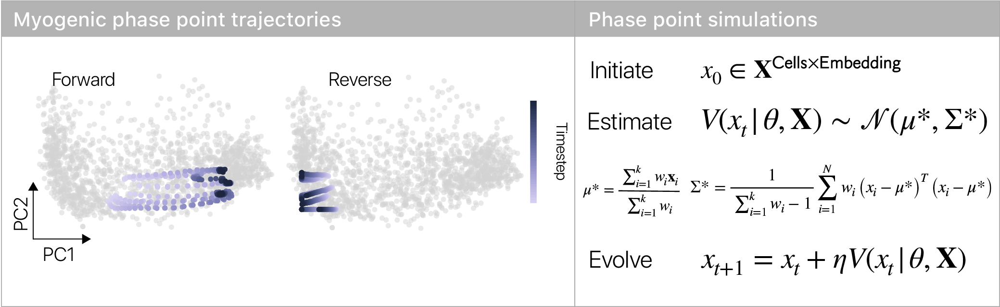

# VeloDyn -- Quantitative analysis of RNA velocity

RNA velocity infers a rate of change for each transcript in an RNA-sequencing experiment based on the ratio of intronic to exonic reads.
This inferred velocity vectors serves as a prediction for the *future* transcriptional state of a cell, while the current read counts serve as a measurement of the instantaneous state.
Qualitative analysis of RNA velocity has been used to establish the order of gene expression states in a sequence, but quantitative analysis has generally been lacking.

`velodyn` adopts formalisms from dynamical systems to provide a quantitative framework for RNA velocity analysis.
The tools provided by `velodyn` along with their associated usage are described below.
All `velodyn` tools are designed to integrate with the `scanpy` ecosystem and `anndata` structures.

We have released `velodyn` in association with a recent pre-print.
Please cite our pre-print if you find `velodyn` useful for your work.


[**Differentiation reveals the plasticity of age-related change in murine muscle progenitors**](https://www.biorxiv.org/content/10.1101/2020.03.05.979112v1)  
Jacob C Kimmel, David G Hendrickson, David R Kelley  
bioRxiv 2020.03.05.979112; doi: https://doi.org/10.1101/2020.03.05.979112

```
@article {Kimmel2020_myodiff,
	author = {Kimmel, Jacob C and Hendrickson, David G and Kelley, David R},
	title = {Differentiation reveals the plasticity of age-related change in murine muscle progenitors},
	elocation-id = {2020.03.05.979112},
	year = {2020},
	doi = {10.1101/2020.03.05.979112},
	publisher = {Cold Spring Harbor Laboratory},
	URL = {https://www.biorxiv.org/content/early/2020/03/06/2020.03.05.979112},
	eprint = {https://www.biorxiv.org/content/early/2020/03/06/2020.03.05.979112.full.pdf},
	journal = {bioRxiv}
}
```

If you have any questions or comments, please feel free to email me.

Jacob C. Kimmel, PhD  
[jacobkimmel+velodyn@gmail.com](mailto:jacobkimmel+velodyn@gmail.com)  
Calico Life Sciences, LLC


## Installation

```bash
git clone https://github.com/calico/velodyn
cd velodyn
pip install .
```

or 

```bash
pip install velodyn
```

# Tutorial

We have provided a `velodyn` tutorial using the Colab computing environment from Google.
This notebook allows for execution of a `velodyn` workflow, end-to-end, all within your web browser.

[velodyn tutorial](https://colab.research.google.com/drive/1JMjw_nJYHmOAEn7ZHL8q2MQbyxmphbni)

## Gene expression state stability measurements

`velodyn` can provide a quantitative measure of gene expression state stability based on the divergence of the RNA velocity field.
The divergence reflects the net flow of cells to a particular region of state space and is frequently used to characterize vector fields in physical systems.
Divergence measures can reveal stable attractor states and unstable repulsor states in gene expression space.
For example, we computed the divergence of gene expression states during myogenic differentiation and identified two attractor states, separated by a repulsor state.
This repulsor state is unstable, suggesting it represents a decision point where cells decide to adopt one of the attractor states.


### Usage

```python
from velodyn.velocity_divergence import compute_div, plot_div

D = compute_div(
    adata=adata,
    use_rep='pca',
    n_grid_points=30,
)
print(D.shape) # (30, 30,)

fig, ax = plot_div(D)
```

## State transition rate comparisons with phase simulations

Across experimental conditions, the rates of change in gene expression space may change significantly.
However, it is difficult to determine where RNA velocity fields differ across conditions, and what impact any differences may have on the transit time between states.
In dynamical systems, phase point analysis is used to quantify the integrated behavior of a vector field.
For a review of phase point simulation methods, we highly recommend *Nonlinear Dynamics & Chaos* by Steven Strogatz.

In brief, a phase point simulation instantiates a particle ("phase point") at some position in a vector field.
The position of the particle is updated ("evolved") over a number of timesteps using numerical methods.

For `velodyn`, we implement our update step using a stochastic weighted nearest neighbors model.
We have a collection of observed cells and their associated velocity vectors as the source of our vector field.
For each point at each timestep, we estimate the parameters of a Gaussian distribution of possible update steps based on the mean and variance of observed velocity vectors in neighboring cells.
We then draw a sample from this distribution to update the position of the phase point.
The stochastic nature of this evolution mirrors the stochastic nature of gene expression.

By applying phase point simulations to RNA velocity fields, `velodyn` allows for comparisons of state transition rates across experimental conditions.
For example, we used phase point simulations to analyze the rate of myogenic differentiation in young and aged muscle stem cells.
These analyses revealed that aged cells progress more slowly toward the differentiated state than their young counterparts.



### Usage

```python
from velodyn.velocity_dynsys import PhaseSimulation

simulator = PhaseSimulation(
    adata=adata,
)
# set the velocity basis to use
simulator.set_velocity_field(basis='pca')
# set starting locations for phase points
# using a categorical variable in `adata.obs`
simulator.set_starting_point(
    method='metadata', 
    groupby='starting_points',
    group='forward',
)
# run simulations using the stochastic kNN velocity estimator
trajectories = simulator.simulate_phase_points(
    n_points=n_points_to_simulate,
    n_timesteps=n_timesteps_to_simulate,
    velocity_method='knn',
    velocity_method_attrs={'vknn_method': 'stochastic'},          
    step_scale=float(step_scale),
    multiprocess=True, # use multiple cores
)

print(trajectories.shape)
# [
#     n_points_to_simulate, 
#     n_timesteps, 
#     n_embedding_dims, 
#     (position, velocity_mean, velocity_std),
# ]
```

## Change in pseudotime predictions

Dynamic cell state transitions are often parameterized by a pseudotime curve, as introduced by Cole Trapnell in `monocle`.
Given RNA velocity vectors and pseudotime coordinates, `velodyn` can predict a "change in pseudotime" for each individual cell.
The procedure for predicting a change in pseudotime is fairly simple.
`velodyn` trains a machine learning model to predict pseudotime coordinates from gene expression embedding coordinates (e.g. coordinates in principal component space).
The future position of each cell in this embedding is computed as the current position shifted by the RNA velocity vector and a new pseudotime coordinate is predicted using the trained model.
The "change in pseudotime" is then returned as the difference between the pseudotime coordinate for the predicted future point and the pseudotime coordinate for the observed point.


### Usage

```python
from velodyn.velocity_dpst import dPseudotime

DPST = dPseudotime(
    adata=adata,
    use_rep='pca',
    pseudotime_var='dpt_pseudotime',
)
change_in_pseudotime = DPST.predict_dpst()
```

## Velocity confidence intervals

RNA velocity estimates for each cell are incredibly useful, but there is no notion of variance inherent to the inference procedure.
If we wish to make comparisons between cells that moving in different directions in gene expression space, we require confidence intervals on each cell's RNA velocity vector.
`velodyn` introduces a molecular parameteric bootstrapping procedure to compute these confidence intervals.
Briefly, we parameterize a multinomial distribution across genes using the mRNA profile for each cell.
We then parameterize a second multinomial distribution for each gene in each cell based on the observed counts of spliced, unspliced, and ambiguous reads.
We sample reads to the observed depth across genes, using the gene-level multinomial to distribute these reads as spliced, unspliced, or ambiguous observations and repeat this prodcued many times for each cell.
We then compute RNA velocity vectors for each bootstrap sample and use these vectors to compute RNA velocity confidence intervals.


### Usage

```python
from velodyn.velocity_ci import VelocityCI

# initialize velocity CI
vci = VelocityCI(
    adata=adata,
)
# sample velocity vectors
# returns [n_iter, Cells, Genes]
velocity_bootstraps = vci.bootstrap_velocity(
    n_iter=n_iter,
    save_counts=out_path,
    embed=adata_embed, # experiment with genes of interest and relevant embedding
)
```
